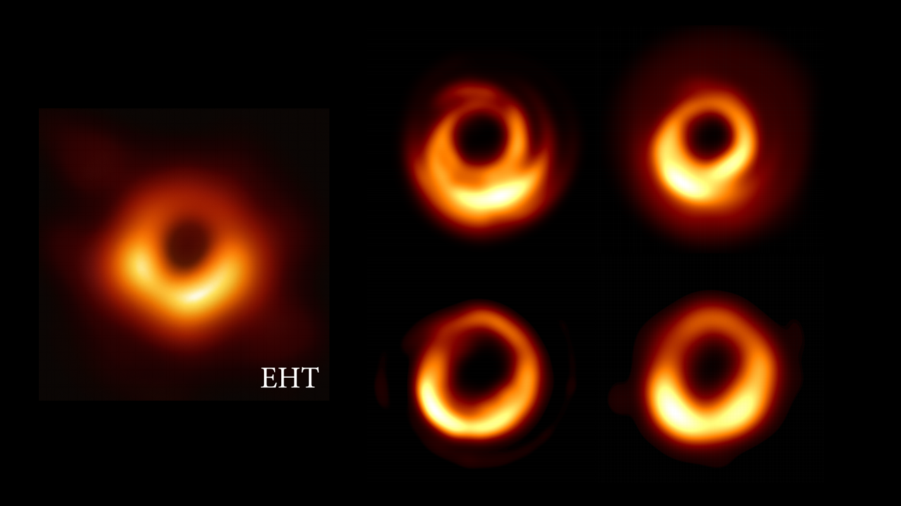
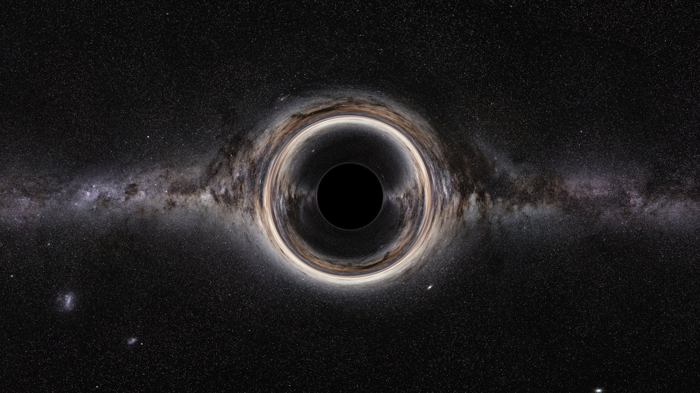

# ParRelRay
Relativistic ray tracer using CUDA

## Input files:
* **input/sim.params:** all parameters (solver precision, image size, black hole, field of view, SSAA, ...)
* **input/trajectory.params:** trajectory/position of the camera
* **input/scene.params:** scene objects (as of 05.05.2021 only textured spheres are implemented)

## Examples:

<video src='examples/earthbh.mp4'>